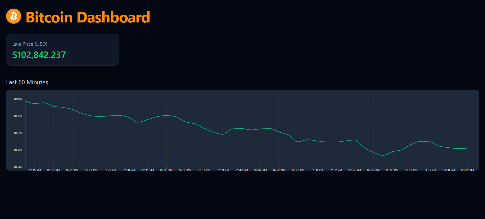

# Professional Crypto Trading Dashboard

A comprehensive full-stack cryptocurrency trading dashboard featuring real-time technical analysis, live price data, interactive charts, and news feeds. Built with Next.js, TypeScript, Tailwind CSS, Flask, and Recharts, powered by Alpaca Markets and GNews APIs.



## Key Features

### Real-Time Technical Analysis
- **RSI (14-period)** - Relative Strength Index with overbought/oversold indicators
- **Volatility Analysis** - Standard deviation of returns with risk assessment
- **Price Change Tracking** - Percentage changes over selected timeframes
- **High/Low Metrics** - Interactive toggleable price extremes

### Live Market Data
- **Real-time price updates** every 10 seconds
- Interactive line charts with customizable timeframes (5–120 minutes)
- Multi-cryptocurrency support (BTC, ETH, DOGE, SHIB, SOL)
- Dynamic color-coded indicators (green/yellow/red) based on market conditions

### Integrated News Feed
- Real-time crypto news headlines from GNews API
- Auto-refreshing news relevant to selected cryptocurrency
- Responsive news column that adapts to screen size

### Advanced UI/UX
- **Smart Settings Panel** - Click-outside-to-close functionality
- **Fully Responsive Design** - Optimized for desktop, tablet, and mobile
- **Professional Dark Theme** - Custom-styled components throughout
- **Interactive Widgets** - Clickable metrics with hover effects
- **Adaptive Layout** - News and chart sections intelligently resize

### Technical Implementation
- **Custom Mathematical Algorithms** for RSI and volatility calculations
- **Real-time Data Pipeline** with error handling and fallbacks
- **TypeScript Integration** for type safety and better development experience
- **Performance Optimized** with efficient re-rendering and data management

## Architecture

### Frontend (Next.js/TypeScript)
- React components with custom hooks
- Real-time state management
- Responsive Tailwind CSS styling
- Interactive Recharts visualizations

### Backend (Flask/Python)
- RESTful API endpoints
- Data transformation and processing
- External API integration (Alpaca Markets, GNews)
- Error handling and validation

## Technical Highlights

- **Mathematical Finance**: Custom RSI and volatility calculation algorithms
- **Real-time Updates**: 10-second refresh cycle with optimized API calls
- **Smart Color Coding**: Dynamic visual indicators based on market thresholds
- **Responsive Widgets**: Adaptive metric cards that fill available space
- **Professional UX**: Click-outside-to-close, hover effects, and smooth transitions

## Technology Stack

**Frontend**
- Next.js 15.3.2
- React 19.0.0
- TypeScript 5
- Tailwind CSS 4
- Recharts 2.15.3
- Heroicons

**Backend**
- Flask 3.1.1
- Python 3.x
- Flask-CORS
- Requests
- Python-dotenv

**APIs**
- Alpaca Markets (Crypto price data)
- GNews (News headlines)

## Getting Started

### Prerequisites
- Node.js 18+
- Python 3.8+
- npm or yarn

### Installation

1. **Clone the repository**
   ```bash
   git clone <repository-url>
   cd bitcoin-visualizer
   ```

2. **Backend Setup**
   ```bash
   cd backend
   pip install -r requirements.txt
   # Create .env file with your API keys
   echo "GNEWS_API_KEY=your_gnews_api_key" > .env
   python app.py
   ```

3. **Frontend Setup**
   ```bash
   cd frontend
   npm install
   npm run dev
   ```

4. **Access the application**
   - Frontend: http://localhost:3000
   - Backend: http://localhost:5000

## Features in Detail

### Technical Indicators
- **RSI Calculation**: 14-period Relative Strength Index using Wilder's smoothing method
- **Volatility Measurement**: Standard deviation of percentage returns over selected timeframe
- **Price Analytics**: Real-time high/low tracking with percentage change calculations

### User Interface
- **Responsive Metric Widgets**: Four equal-width cards displaying key market metrics
- **Interactive Chart**: Zoomable, tooltipped price visualization
- **Settings Panel**: Dropdown for symbol selection and timeframe adjustment
- **News Integration**: Scrollable news feed with external link support

Built for traders and crypto enthusiasts who need professional-grade market analysis tools with real-time data visualization.
