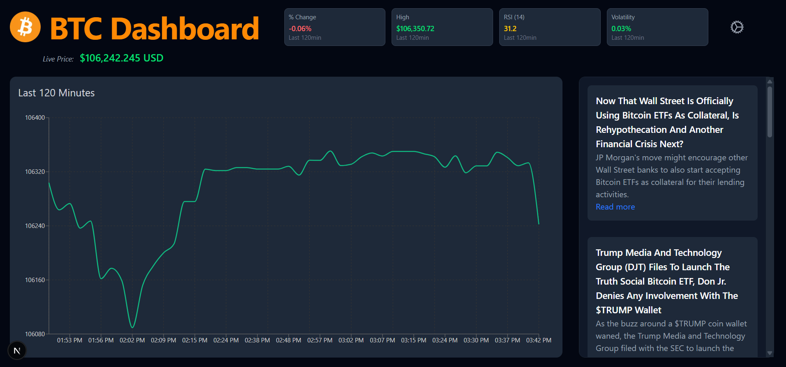

# 📊 Crypto Dashboard

A full-stack web app that displays the **live price**, **interactive chart**, and **latest news headlines** for popular cryptocurrencies like **Bitcoin (BTC)** and **Ethereum (ETH)**. Built with **Next.js**, **Tailwind CSS**, **Flask**, and **Recharts**, and powered by **Alpaca** and **GNews** APIs.

---

## 🔧 Features

- 💰 **Live crypto prices** updated every minute
- 📈 Interactive line chart for historical price over a selectable time window (5–120 minutes)
- 📰 Scrollable right-hand **news column** with headlines from GNews
- 🔄 Symbol selector in settings pane (BTC, ETH, SHIB, DOGE, SOL)
- Responsive, clean UI with Tailwind CSS
- Flask backend handles data transformation and API integration

